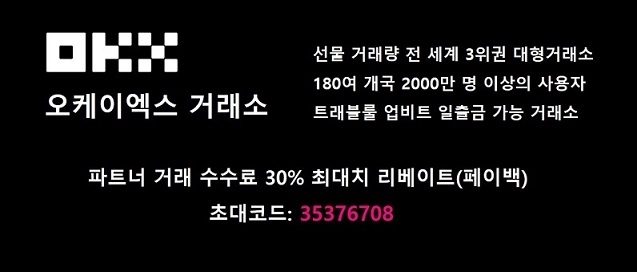
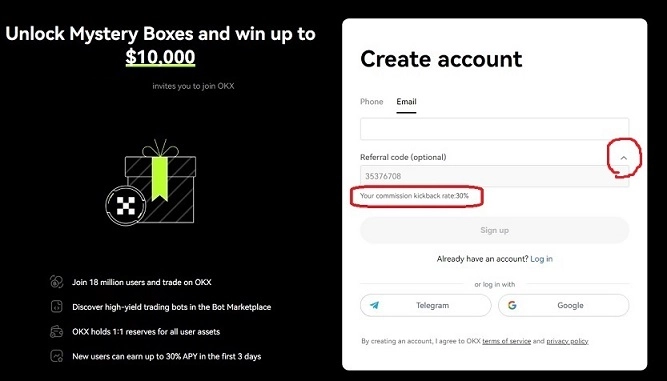
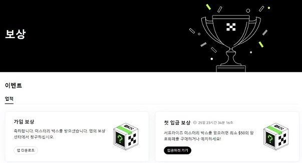

# OKX交易所注册指南：30%手续费返佣+最高1万美元神秘礼盒奖励

如果你正在寻找一家支持多样化交易、费率透明且有实际返佣的交易所，OKX（欧易）可能是个不错的选择。本文将带你了解OKX的基本信息、费率结构，以及如何通过邀请码获得30%手续费返佣和新人专属礼盒奖励。

---

## OKX交易所是什么?

**OKX交易所**是一家成立于2014年的全球性加密货币交易平台,总部位于香港。作为OKcoin的子公司,OKX前身为OKEX,后更名为现在的品牌。

目前,OKX在全球拥有超过200个国家和地区的2000多万用户。根据CoinMarketCap数据:
- **现货交易量**排名前6位
- **合约交易量**稳居前3位
- 比特币日均期货交易量达到150亿美元

平台支持现货、杠杆、期货、期权、永续合约、DeFi等多种交易方式,提供512个以上的加密货币交易对。值得一提的是,OKX已通过VASP Travel Rule合规认证,支持与韩国Upbit等交易所自由出入金。

---

## 如何获得30%手续费返佣?

OKX目前提供的最高返佣比例为**30%**,这也是平台设定的上限。

**官方邀请链接**：👉 [立即注册领取30%手续费终身返佣](https://www.okx.com/join/62834398)

**邀请码**：62834398

需要注意的是,由于此前部分邀请码返佣比例过高,OKX官方已将所有返佣比例统一限制为30%。这意味着无论使用哪个邀请码,最高只能获得30%的手续费返佣。

### 注册时的验证步骤

在注册时,请务必点击下图箭头所示位置,确认显示"**Your commission kickback rate: 30%**"。如果没有显示任何信息,则表示返佣比例为0%。

---

## OKX交易所手续费标准

### 现货交易手续费
- **挂单(Maker)**：0.08%
- **吃单(Taker)**：0.10%

### 合约交易手续费
- **挂单(Maker)**：0.02%
- **吃单(Taker)**：0.05%

**使用30%返佣后的实际费率**：
- 合约挂单：0.014%
- 合约吃单：0.035%

相比不使用返佣,长期交易下来能节省相当可观的成本。

---

## 新人专属：最高1万美元神秘礼盒

除了手续费返佣,OKX还为新用户准备了神秘礼盒奖励活动。在**Rewards(奖励)**菜单中,符合条件的用户可以获得2次开启礼盒的机会:

**第一次**：安装APP并登录即可领取第一个神秘礼盒

**第二次**：在30天内完成50美元以上的充值或购买,即可领取第二个神秘礼盒

每个神秘礼盒内包含随机数额的加密货币奖励,最高可达**10,000美元**。奖励类型包括BTC、ETH、DOT、USDT以及手续费返佣卡等。

需要注意的是,神秘礼盒只能在**OKX手机APP**中开启。

---

## 总结

OKX作为全球前列的加密货币交易平台,在交易量、产品丰富度和合规性方面都有不错的表现。对于想要降低交易成本的用户来说,30%的手续费返佣和新人礼盒活动都是实实在在的福利。

如果你正在寻找一个交易品种齐全、费率透明、支持多种交易方式的平台,👉 [立即注册OKX获取30%终身返佣](https://www.okx.com/join/62834398),开启你的加密货币交易之旅。
